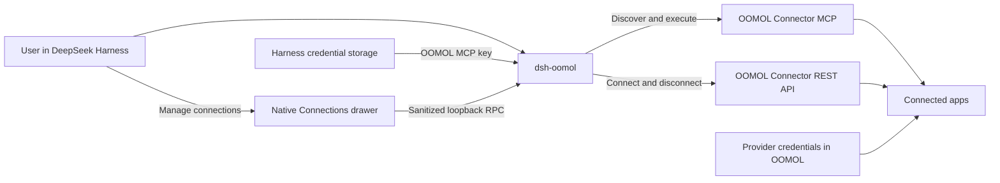

# OOMOL Connector for DeepSeek Harness

Use apps and services connected through OOMOL directly from DeepSeek Harness.

`dsh-oomol` gives DeepSeek Harness progressive access to OOMOL Connector: discover the connectors available to an account, inspect an Action only when it is needed, and execute it without copying Provider credentials into Harness.

[npm package](https://www.npmjs.com/package/dsh-oomol) · [中文文档](./docs/README.zh-CN.md)

> [!NOTE]
> This plugin uses DeepSeek Harness's official bundle, client-slot, credentials, and MCP-client standards. It does not patch Harness source code.

## What you can do

With this plugin, DeepSeek Harness can:

- discover apps connected to your personal or team OOMOL identity;
- search the Actions exposed by a Connector;
- load an Action schema only when it is needed;
- execute Connector Actions through OOMOL's hosted MCP endpoint;
- open a native right-side Connections drawer to add, inspect, or disconnect Provider accounts;
- reload the OOMOL connection after its key is added, rotated, or removed; and
- test MCP initialization and discovery from **Settings > Plugins**.

The plugin deliberately keeps a small discovery surface instead of registering every Connector Action as a permanent Harness tool.

## Install with one prompt

Paste this prompt into a DeepSeek Harness session that has terminal access:

```text
Install the latest stable OOMOL Connector plugin (`dsh-oomol`) into my
DeepSeek Harness `web` profile using the official `dsh plugin` CLI.

Before installing, verify that Node.js 22.19 or later and the `dsh` CLI are
available. Do not use sudo. Do not ask for, read, print, or store any API keys,
and do not modify unrelated Harness profiles or configuration.

After installation, verify that the package was added successfully. If the
current Harness process must be restarted, do not terminate this session;
give me the exact restart command instead. Then guide me to Settings > Plugins
> OOMOL Connector to configure my OOMOL MCP API key. If installation fails,
stop and show me the exact error instead of trying unrelated workarounds.
```

The installation requires a Harness restart before the plugin becomes active.

## Manual installation

### Requirements

- Node.js `22.19` or later, or Node.js `24+`
- DeepSeek Harness
- an OOMOL account
- a dedicated OOMOL MCP API key

Install the plugin into the Web profile:

```bash
dsh plugin --profile web add -w dsh-oomol
```

Start or restart DeepSeek Harness:

```bash
dsh web
```

Open the URL printed in the terminal, then continue with [Connect your OOMOL account](#connect-your-oomol-account).

## Connect your OOMOL account

Create a dedicated key on the [OOMOL API keys page](https://console.oomol.com/api-key). This is an **OOMOL MCP client key**. It is not:

- your DeepSeek model API key;
- an OAuth token or API key for Gmail, Notion, Slack, GitHub, or another Provider; or
- an internal `oo` CLI authentication file.

Provider OAuth tokens and API keys remain in OOMOL Connector. DeepSeek Harness stores only the dedicated, revocable OOMOL MCP key.

Do not paste the key into a chat message. Configure it through the write-only settings field:

1. Open **Settings** in DeepSeek Harness.
2. Select **Plugins**.
3. Find **OOMOL Connector** under plugin configuration.
4. Paste the dedicated OOMOL MCP key and select **Save key**.
5. Select **Test connection**.
6. Confirm that the connection state changes to **Connected**.

The browser receives only whether the key is configured, its source, and whether it is writable. It never receives the stored value.

After the test succeeds, select **Connections** in a conversation header. You can also open the same right-side drawer from **Settings > Plugins > OOMOL Connector > Manage connections**. OAuth continues in a popup; API keys and custom credentials are submitted directly to OOMOL Connector and are never saved by this plugin. The permanent OOMOL MCP key remains in the Harness Host and is never put in the drawer URL or returned to browser code.

The drawer covers the common connection flow. Use the [OOMOL Console](https://console.oomol.com/connections) for advanced connection settings that are not yet exposed in the preview.

### Team connections

The current settings card uses your personal OOMOL identity by default. To use a team-scoped identity, set the team name before starting Harness:

```bash
export OOMOL_TEAM_NAME="your-team"
dsh web
```

Leave `OOMOL_TEAM_NAME` unset for a personal identity. Team selection in the settings UI is planned.

### Environment-only key configuration

For headless or managed environments, provide the key to the launching process:

```bash
export OOMOL_MCP_API_KEY="api_..."
dsh web
```

A key supplied by the launch environment is read-only in the settings card and must be changed at its source.

## Try it

After the connection test succeeds, start with read-only discovery prompts:

```text
Show me the OOMOL connectors available to this account.
```

```text
Find the available Actions for my Notion connector. Do not execute anything.
```

```text
Check whether one of my connected apps can create a calendar event. Inspect
the Action schema first and do not execute it yet.
```

For an Action with side effects, ask Harness to show the proposed arguments and wait for confirmation:

```text
Prepare an Action that adds a row to my connected spreadsheet. Show me the
target account, Action name, and proposed values, then ask for confirmation
before executing it.
```

## How it works



The Host plugin resolves the OOMOL MCP key through the Harness credentials service first and the launch environment second. It then composes DeepSeek Harness's official Streamable HTTP MCP client with OOMOL's hosted endpoint.

Connector capabilities are disclosed progressively: Harness searches for a relevant Action, reads the selected guide and schema, and then executes the exact Action. Normal execution uses MCP directly and does not launch OOCLI or read OOCLI's internal authentication files.

For implementation details, see [Architecture](./docs/ARCHITECTURE.md).

## Project status

| Capability | Status |
| --- | --- |
| Public npm package | Available |
| Hosted OOMOL MCP connection | Available |
| Progressive Connector and Action discovery | Available |
| Connector Action execution | Available |
| Write-only key configuration in Settings | Available |
| Live connection status and connection test | Available |
| Native right-side connection manager | Preview |
| Personal OOMOL identity | Available |
| Team identity through the launch environment | Available |
| Team selection in Settings | Planned |
| Passwordless MCP-key pairing | Planned |
| Action-aware approval presentation | Planned |
| Workflow authoring and execution | Not included |

The packaged artifact is covered by Node.js 22 and 24 CI, unit tests, a clean-profile install, and a Web boot smoke test. Authenticated Action execution against a real OOMOL account remains a release validation item. See the [Roadmap](./docs/ROADMAP.md) for the full checklist.

## Configuration reference

The installed bundle adds one `oomol` row. A later profile layer may replace its non-secret configuration:

```yaml
- id: oomol
  name: dsh-oomol
  config:
    endpoint: https://connector.oomol.com/v1/mcp
    apiKeyEnv: OOMOL_MCP_API_KEY
    teamNameEnv: OOMOL_TEAM_NAME
    serverName: oomol
    toolCallTimeoutMs: 60000
    failOnStartupError: false
```

Do not place the API key itself in `cordis.patch.yml`. Runtime credential resolution keeps the secret out of the bundle layer and normal `dsh --dump-config` output.

## Troubleshooting

| Symptom | Likely cause | What to do |
| --- | --- | --- |
| npm reports that `dsh-oomol` cannot be found | npm is using a different registry, or its metadata cache is stale | Verify that `npm config get registry` returns `https://registry.npmjs.org/`, then retry |
| The plugin does not appear in Settings | It was installed into another profile, or Harness has not restarted | Install into the `web` profile and restart `dsh web` |
| The key is shown as not configured | No key was saved for this profile | Save it in **Settings > Plugins > OOMOL Connector** |
| Connection state is **Unauthorized** | The OOMOL MCP key is invalid, expired, or revoked | Create a dedicated replacement key and save it again |
| Connection succeeds but the expected app is missing | The Provider is not connected, or the selected team identity is wrong | Check [OOMOL connections](https://console.oomol.com/connections) and `OOMOL_TEAM_NAME` |
| A launch-environment key cannot be changed in Settings | Environment credentials are read-only in the browser | Change `OOMOL_MCP_API_KEY` where Harness is launched and restart it |
| The plugin fails after an upgrade | Installed Harness and plugin dependencies are out of sync, or a compatibility regression occurred | Update `dsh-oomol`, restart Harness, and open an issue with both installed versions if the problem remains |

The local environment doctor reports readiness without printing credential values:

```bash
pnpm run doctor
```

## Security

### For users

- Never paste an OOMOL MCP key into chat or commit it to Git.
- Use a separate, revocable OOMOL key for each Harness installation.
- Review externally visible, destructive, permission-changing, or broad-sharing Actions before approving execution.
- Do not automatically retry a side-effecting Action when its outcome is unknown.
- Removing this plugin does not remove or disconnect Provider accounts in OOMOL.

### For developers

- Keep Provider credentials in OOMOL Connector; never persist them in this repository or a Cordis patch.
- Resolve the OOMOL MCP key through Harness credentials first, then the launch environment.
- Do not read OOCLI internal authentication files.
- The MCP `execute_action` contract does not carry the HTTP Action API's idempotency key.

Report vulnerabilities according to [SECURITY.md](./SECURITY.md). Do not open a public issue containing credentials, Provider data, or exploit details.

## Development

Install dependencies and run the required checks:

```bash
pnpm install --frozen-lockfile
pnpm check
```

### Install from a checkout

Build the plugin and install its absolute path into the Web profile:

```bash
pnpm build
dsh plugin --profile web add -w "$(pwd)"
```

Start Harness:

```bash
dsh web
```

Run the environment doctor without printing credentials:

```bash
pnpm run doctor
```

With a real OOMOL MCP key, verify hosted MCP initialization and the progressive discovery surface:

```bash
OOMOL_MCP_API_KEY="..." pnpm verify:connector
```

The verifier suppresses remote error text and never prints the credential value.

## Uninstall

```bash
dsh plugin --profile web remove dsh-oomol
```

Uninstalling the plugin does not remove or disconnect Provider accounts in OOMOL.

## License

[MIT](./LICENSE)
